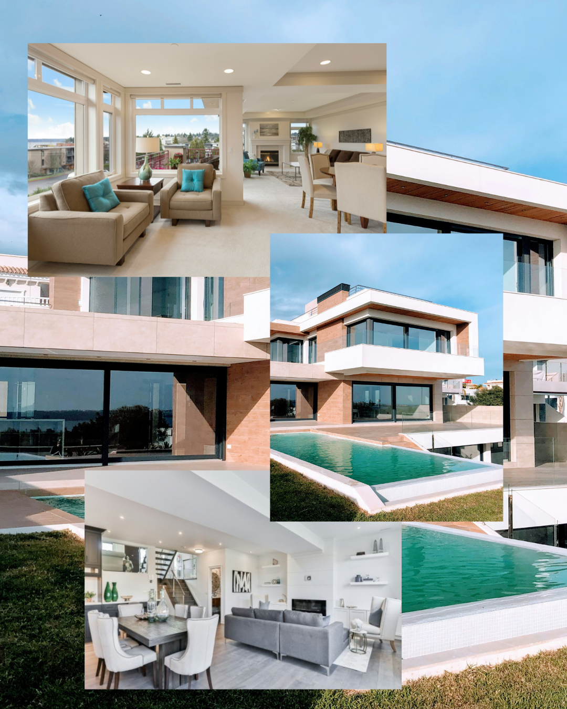
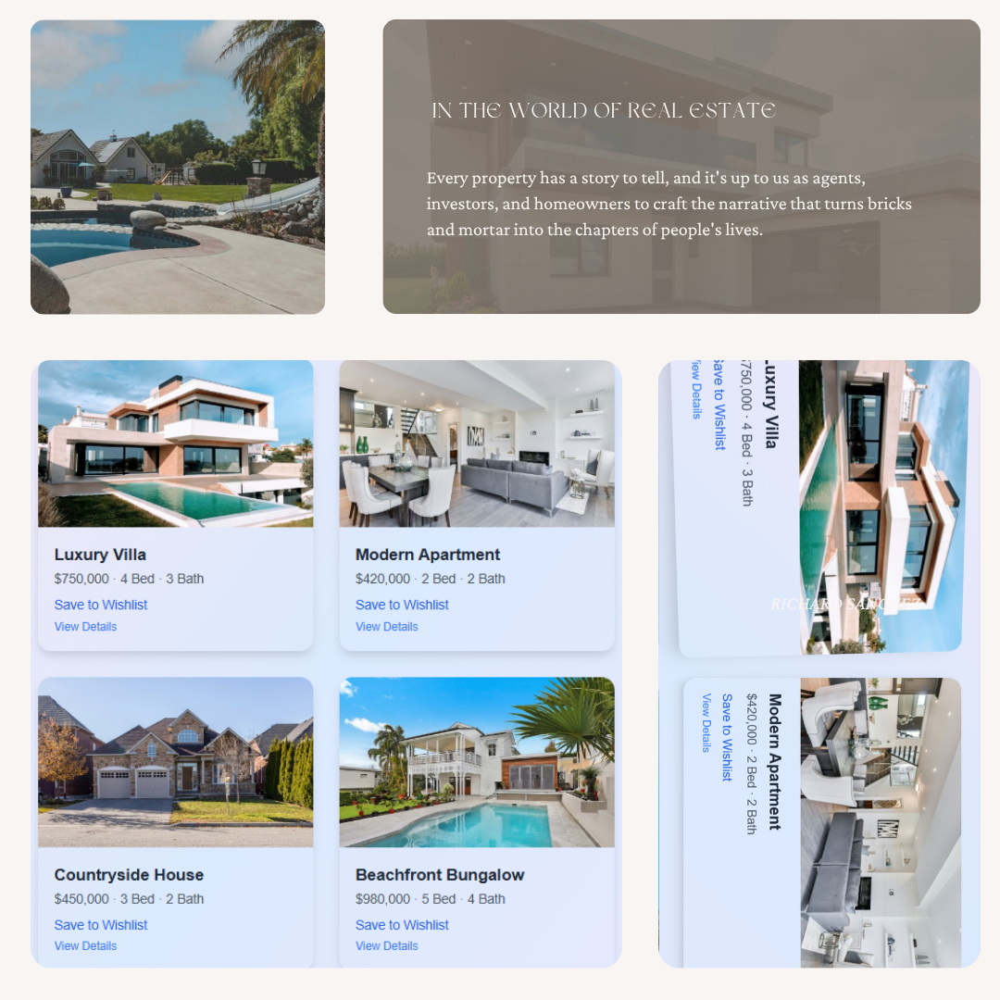

# 🏡 Real Estate Website

A clean, modern, and responsive Real Estate Website built using **HTML, CSS, and JavaScript**. This project showcases a professional-looking frontend design for property listings, contact forms, and services.

---

## 🔗 Live Demo

🚀 [Visit the Live Site](https://real-estate-js.netlify.app/)

---

## 📸 Screenshots

### 💻 First View

### 📱 Second View

---

## ⚙️ Tech Stack

- HTML5
- CSS3
- JavaScript
- Netlify (Deployment)

---

## ✨ Features

- 📱 Fully responsive layout
- 🏠 Property cards with images and pricing
- 📨 Functional contact form
- 📌 Clean and modern UI
- ⚡ Fast and lightweight

---

---

## 📬 Connect With Me

- [LinkedIn](https://www.linkedin.com/in/your-link)   
- [GitHub](https://github.com/mayu615)

---

## 📄 License

This project is intended for educational/demo purposes.

---

made with 💗 @Mayuri Chatap
